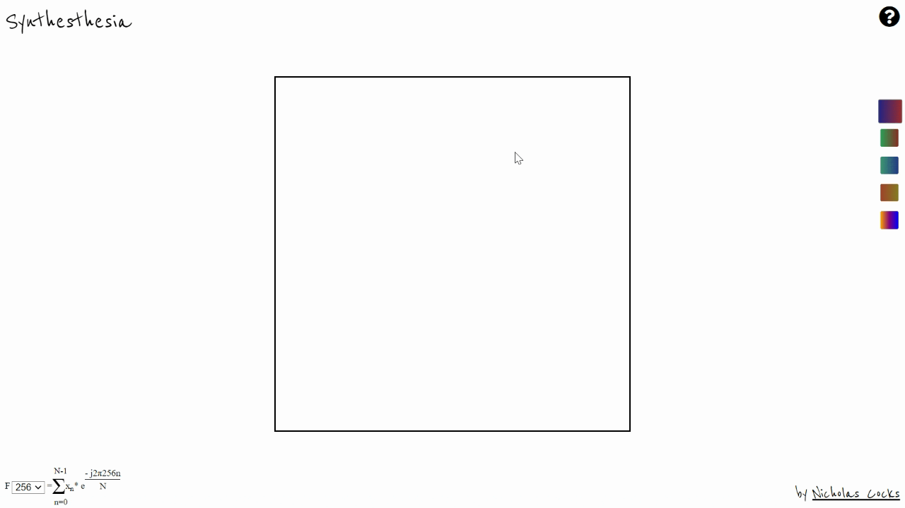
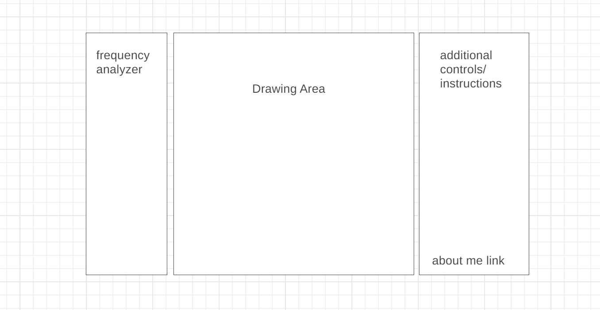

# Synthesthesia
Welcome to the Synthethesia wiki! [Live Link](https://nicholascocks.github.io/Synthesthesia/).

## Overview
Synthesthesia is a meditative drawing app that allows users to draw sound and have the canvas dynamically react to their sounds and mouse movements.

## Functionality & MVP
With Synthesthesia, users are be able to:

* Free-draw onto a canvas and have notes played corresponsding to their mouse's position. 
* A frequency analyzer to show the waveforms of the notes they're drawing.
* A visual display of the fast fourier transform, allowing users to select scale.
* The ability to select between dynamically colored brushed.

## Architecture and Technologies
* **CanvasHTML**
* **Web Audio Api**
* **Tone.js**

**Tone.js:** built on the Web Audio Api, was utilized for the Casio sound played when drawing and for help implementing the Frequnecy Analyzer using the Fast Fourier Transformation. The Web Audio Api (native to Javascript) allows for the creation of 'AnalyzerNodes' which link between sound source and destination and can return an array of 'discrete data point' based on the set 'FFT Size'. 
  Tone.js builds on top of this by converting the Float value of each discrete data point to decibels; allowing for a exponential scaling of volume rather than linear which more accurately reflexs how humans hear.

**CanvasHTML:** for implementing user drawing. A challenge in this is that mouseover events are 'too precise' leading to pixelated, jagged brush strokes and notes being played 'too fast'. This lead to the buidling of a system to record mouseover events into a queue data structure and then calculate quadratic curves based on mouse position, leading to slightly 'corrected' brush strokes that gave a more natural feel and smoother edges. 
  This also allowed for easy debouncing of events that would trigger notes and for dynamically colored brushes. It was definitely the key insight to the project.

## Wireframe
Original wireframe for the app, the center of the app will be the drawing plane. Will additional controls to the side of the app. 

## Timeline
* Setup drawing logic. Ability to draw and have mouse position returned for each mouseover event!  
* Created instrument and had it be triggered by mouseover events!
* Created frequecy analyzer function using Web Audio Api's Fast Fourier Transform (FFT)!
* Created queue and have lines drawn use Canvas's quadratic curves!
* Added brushes!

